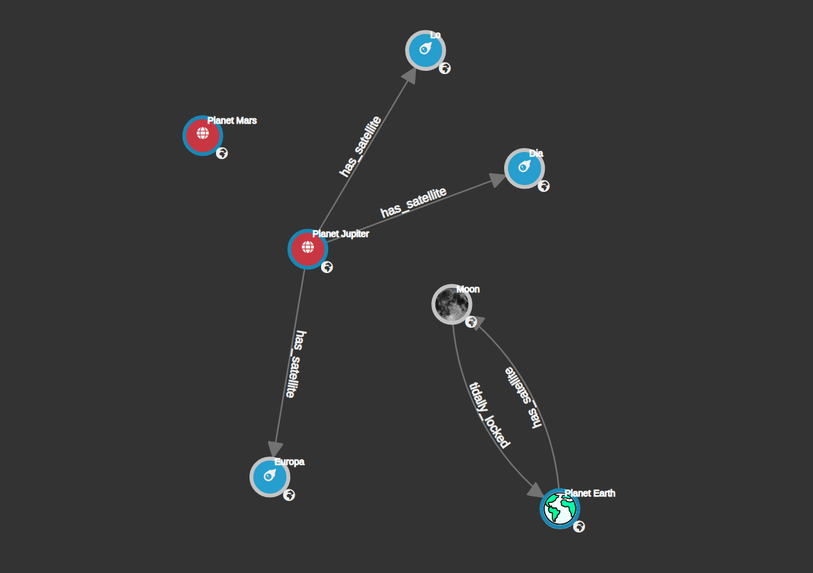

# Graph Canvas 

Graph Canvas is [d3](https://d3js.org) based Graph UI library built 
at [InvanaGraph](https://invana.io) for creating beautiful Graph 
representations.




```html

<script src="/src/example-data.js"></script>
<script src="/src/canvas-utils.js"></script>
<script src="/src/canvas.js"></script>
<script>

    const links = Object.assign([], graphs.links);
    const nodes = Object.assign([], graphs.nodes);

    let canvasHTMLSelector = "#graphCanvas";

    function onNodeClick() {
        console.log("onNodeClick triggered")
    }

    function onNodeMouseOver() {
        console.log("onNodeMouseOver triggered")
    }

    function onNodeMouseOut() {
        console.log("onNodeMouseOut triggered")
    }


    function onLinkClick() {
        console.log("onLinkClick triggered")
    }

    function onLinkMouseOver() {
        console.log("onLinkMouseOver triggered")
    }

    function onLinkMouseOut() {
        console.log("onLinkMouseOut triggered")
    }


    const nodeOptions = {
        "Planet": {
            "bgImagePropertyKey": "image",
            "labelOptions": {
                "showLabel": true,
                "labelTextFn": (node) => "Planet " + node.properties.name,
            },
            "shapeOptions": {
                "radius": 24,
                "strokeWidth": "4px",
                "fillColor": "#ba4040",
                "inShapeHTML": "<i class=\"fas fa-globe-americas\"></i>"

            }

        },
        "Satellite": {
            "bgImageUrl": "https://pngimg.com/uploads/moon/moon_PNG19.png",
            "labelOptions": {
                "showLabel": true,
                "labelTextFn": (node) => node.properties.name,
            },
            "shapeOptions": {
                "radius": 24,
                "strokeWidth": "4px",
                "strokeColor": "#c4c4c4",
                "fillColor": "#519ad2",
                // "inShapeHTMLFn": (node) => node.properties.name.substring(0, 3)
            },

        }
    }

    const nodesData = prepareNodesDataWithOptions(nodes, nodeOptions);
    const linksData = prepareLinksDataForCurves(links);


    console.log("nodesData", nodesData)
    canvas = new InvanaGraphUI(canvasHTMLSelector,
        nodesData,
        linksData,

        onNodeClick,
        onNodeMouseOver,
        onNodeMouseOut,

        onLinkClick,
        onLinkMouseOver,
        onLinkMouseOut,
    );
</script>
```

- [ ] drawCanvas

- [ ] setnodeFillColor
- [ ] setNodeRadius
- [ ] setNodeStrokeColor
- [ ] setNodeTagImage - one of the right bottom of node.
- [ ] setNodeCenterText
- [ ] setNodeLabel
- [ ] setNodeShape [Not important during beta]

- [ ] setLinkLength
- [ ] setLinkStrokeColor
- [ ] setLinkStrokeType
- [ ] setLinkBorderColor
- [ ] setLinkLabel
- [ ] setLinkLabelColor
- [ ] setArrowHeadColor

- [ ] fixNodePosition
- [ ] releaseNodePosition


- [ ] showToolTip
- [ ] hideToolTip

- [ ] ZoomInCanvas
- [ ] ZoomOutCanvas
- [ ] pan

- [ ] CenterObjectsInCanvas
- [ ] onDragStarted
- [ ] onDragEnded


## Events

- [ ] onNodeMouseOver
- [ ] onNodeMouseOut
- [ ] onNodeClick
- [ ] onNodeDblClick
- [ ] onLinkMouseOver
- [ ] onLinkMouseOut
- [ ] onLinkClick
- [ ] onLinkDblClick
